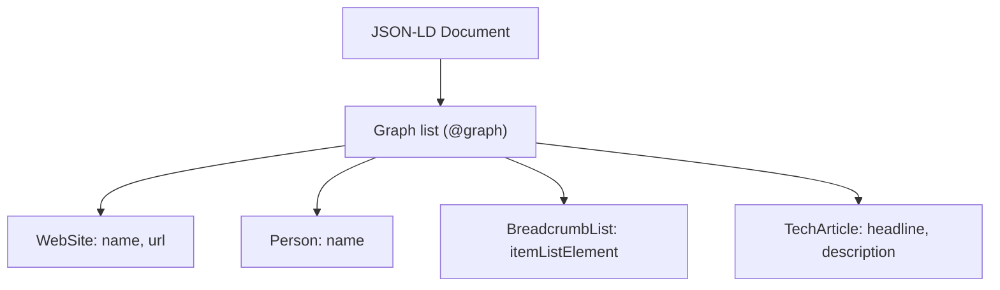
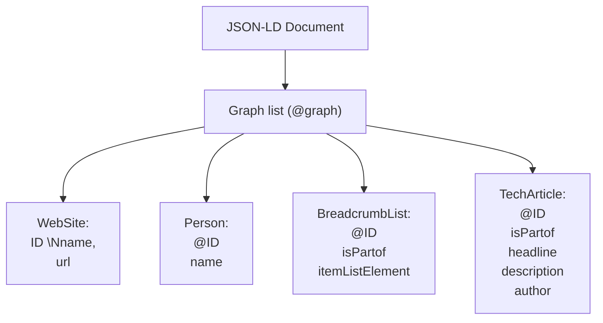
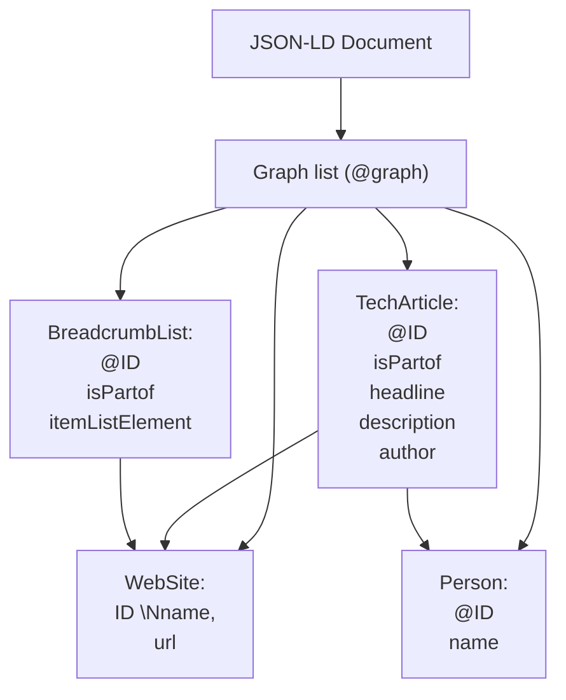

Title: Van BilboWasHere tot JSON-LD

Abstract: |
  Vroeger was een unieke zoekterm genoeg om gevonden te worden.
  Tegenwoordig willen zoekmachines niet alleen weten waar een pagina
  over gaat, maar vooral wat een pagina is. Een persoonlijke verkenning
  van moderne SEO, structured data, JSON-LD en het onverwachte moment
  waarop een verzameling JSON-objecten ineens veranderde in een
  gegevensmodel.

meta_title: Van BilboWasHere tot JSON-LD - SEO, semantiek en Linked Data

meta_description: |
  Een persoonlijke ontdekkingstocht van oude SEO-technieken naar
  moderne structured data. Hoe JSON-LD, @graph en Linked Data mij
  lieten inzien dat zoekmachines vooral betekenis zoeken.
---

Ergens rond de eeuwwisseling heb ik mijn eerste website gemaakt. Ik was toen actief binnen de [NedLinux-community](https://nedlinux.nl) en wilde kennis die verspreid stond over forums omzetten naar artikelen. Verhalen over Slackware, Samba en weet ik veel wat nog meer.

Naar een idee van Perl-goeroe [Randal L. Schwartz](https://en.wikipedia.org/wiki/Randal_L._Schwartz) had ik een unieke term op mijn homepage gezet: `BilboWasHere`.

Het idee was simpel. Als Google die term zou oppikken, was mijn site automatisch geïndexeerd. Wilde iemand naar mijn website? Dan hoefde ik alleen maar te zeggen:

"Google maar eens op BilboWasHere."

En het werkte. Binnen een week stond mijn site in Google.

Hoe anders is dat in 2026.

Mijn huidige site, MySite, staat al sinds februari 2026 online. Google weet dat hij bestaat. Dat is het probleem niet. Maar indexeren? Laten we zeggen dat Google niet direct onder de indruk lijkt.

Natuurlijk kunnen we een discussie voeren over de vraag of de site überhaupt de moeite waard is om te indexeren.

Mijn mening daarover is verrassend eenvoudig:

**Ik vind van wel.**

## Schrijven was belangrijker dan gevonden worden

MySite is een zelfgeschreven cms (bewust met kleine letters; het moet nog wat groeien). De afgelopen maanden ben ik vooral bezig geweest met artikelen. Het kunnen schrijven ervan, plaatjes kunnen toevoegen, een mermaid parser bouwen. 

Sterker nog: tot op de dag van vandaag voeg ik statische pagina's zoals de "About Me"-pagina nog steeds met de hand toe aan de database.

Ik had overigens wel rekening gehouden met SEO:

Artikelen en pagina's hadden allemaal een `meta_title` en een `meta_description`. Zelfs categorieën en statische pagina's hadden daar velden voor.

Alleen gebruikte ik die alleen voor artikelen, daar is in voorzien met een CRUD interface. 

Statische pagina's en categorieën?

SQL inderdaad!

Vervolgens deed ik er in de templates helemaal niets mee.

Het enige echte SEO-middel dat ik had, was een degelijke `sitemap.xml`. Die kon ik tenslotte mooi on-the-fly genereren en daar houd ik als programmeur van.

Ik was zelfs te lui geweest om die meta title en description van de artikelen (die ik wel had) daadwerkelijk in de HTML-header te zetten.

How hard can it be?

In mijn hoofd was ik vooral bezig de site leuk te maken.

Daar ontstond bijvoorbeeld ook het PTL-project uit, waarmee ik timelapse-video's van desem wilde maken. Daar moet ik trouwens eens mee verder.

## De confrontatie met Google Search Console

Op een gegeven moment besloot ik eens serieus naar Google Search Console te kijken.

Daar schrok ik eerlijk gezegd best van.

Google had ongeveer twaalf pagina's van de ruim dertig pagina's gevonden. Daarvan werden er precies nul geïndexeerd. Er waren meldingen over niet-canonieke pagina's, pagina's die via meerdere URL's bereikbaar waren. En allerlei andere technische bezwaren.

Daar ben ik eerst maar eens mee aan de slag gegaan.

- Canonical URL's toegevoegd.
- Het URL-schema opgeschoond.
- Dubbele routes verwijderd.

Allemaal nette dingen. Maar het effect bleef beperkt.

Hoog tijd om mij te verdiepen in moderne SEO.

## SEO is niet meer wat het was

Uit een ver verleden kende ik nog begrippen als keyword density. Het idee dat je Google moest vertellen waar een pagina over ging door bepaalde woorden vaak genoeg te gebruiken.

Maar terwijl ik mij door allerlei SEO-artikelen heen werkte, begon ik iets anders te zien. Ik kwam steeds vaker termen tegen als `json-ld`. Dat zou structured data zijn. 

Structured Data? Website?

Maar dat blijkt best wel logisch te zijn. SEO gaat tegenwoordig veel minder over woorden. Het gaat steeds meer over betekenis.

Rond het jaar 2000 probeerden we Google uit te leggen waar een pagina over ging.
In 2026 moeten we Google uitleggen wat een pagina **is**.

- Is dit een artikel?
- Een auteur?
- Een categoriepagina?
- Een website?
- Een recept?
- Een evenement?
- Een whatever?

Google, Bing en nog wat andere search-bedrijven hebben er [een definitie](https://schema.org) voor gemaakt. 

Voor mij lijkt het een beetje op [SGML](https://en.wikipedia.org/wiki/Standard_Generalized_Markup_Language), betekenis geven aan document elementen. Dit is een header, dit is een hoofdstuk, een section. Zo schreef ik vroeger Howto's. Eén SGML en ik liet een parser de output maken (txt, html, pdf, whatever) en een stylesheet bepaalde wel hoe het eruit kwam te zien.

## Structured Data

Structured Data is eigenlijk niets meer dan een semantische beschrijving van je website.

Je vertelt expliciet uit welke onderdelen een pagina bestaat en hoe die onderdelen met elkaar samenhangen. Een artikel heeft een auteur, een auteur publiceert op een website, een pagina heeft breadcrumbs, een categorielijst bevat artikelen.

Dat soort relaties. Die informatie publiceer je meestal via iets dat JSON-LD heet. Ja, gewoon JSON.

Daarnaast bestaan er nog Open Graph-tags, Twitter Cards en allerlei andere manieren om metadata over je pagina te publiceren.

Wat mij daarbij direct opviel, was dat ze grotendeels dezelfde gegevens gebruiken.

- De titel van een pagina blijft dezelfde titel.
- De beschrijving blijft dezelfde beschrijving.
- De auteur blijft dezelfde auteur.

Alleen de representatie verandert.

## Toen begon ik een tweede template-engine te bouwen

Mijn eerste gedachte was om een objectmodel te maken. Een basisobject met alle SEO-informatie erin. Daarboven verschillende methodes die Open Graph, Twitter Cards of JSON-LD konden genereren. Op papier klonk dat best logisch. Tot ik mij realiseerde wat ik eigenlijk aan het doen was.

Ik was bezig een tweede template-engine te bouwen. Naast de template-engine die ik al had. Mijn website gebruikt Dancer2 volgens het MVC-principe. En binnen dat model is Template Toolkit verantwoordelijk voor de view-laag.

HTML genereren is een view. Maar JSON genereren is dat net zo goed. Waarom zou ik daarvoor een heel nieuw objectmodel bouwen? Ik had het gereedschap al.

Sterker nog: ongeveer negentig procent van de gegevens die ik nodig had voor JSON-LD werd al doorgegeven aan Template Toolkit.

Het enige wat ontbrak was een andere template.

## Templates voor SEO

Daarom geef ik tegenwoordig één extra parameter mee aan de template: `page_type`

Deze bepaalt welk SEO-template gebruikt moet worden.

In `main.tt` wordt gekeken of `page_type` aanwezig is. Zo ja, dan wordt het daarbij behorende template ingesloten.

## Een graph in plaats van één object

Veel voorbeelden op internet tonen één enkel JSON-LD-object. Voor mijn situatie bleek een `@graph` veel handiger. Daarmee kan ik meerdere entiteiten beschrijven binnen dezelfde pagina:

- WebSite
- Person
- BreadcrumbList
- TechArticle

Voor een artikel als dit levert dit de volgende structuur op:

Deze objecten krijgen allemaal hun eigen `@id`. Daarmee kunnen ze naar elkaar verwijzen. Nu begint er, in mijn hoofd tenminste, iets te jeuken: dit ken ik ergens van: 

Dit kan zelfs nog explicieter gemaakt worden:

- Het artikel verwijst naar de auteur.
- De auteur verwijst naar de website.
- De breadcrumbs verwijzen naar de verschillende pagina's.

Zodra je deze relaties expliciet maakt ontstaat er iets heel anders dan de eerdere boomstructuur:

En toen viel bij mij het kwartje. 

Ik keek niet meer naar een JSON-document. 

Eerst objecten, daarna unieke identifiers en vervolgens relaties tussen die objecten. Het begon steeds meer op een ERD te lijken, een gegevensmodel.

Daarmee is ook de `LD` in `json-ld` verklaard: `LD` betekent namelijk `linked data`.

Geen HTML die Google moet interpreteren.

Geen gokwerk.

Gewoon expliciet vastleggen wat ieder onderdeel voorstelt.

## En nu?

Of dit er morgen voor zorgt dat Google MySite ineens massaal gaat indexeren weet ik niet. SEO blijft voor een deel een blackbox. Maar het voelt wel alsof ik eindelijk begrijp wat zoekmachines tegenwoordig verwachten.

- Niet alleen pagina's.
- Niet alleen woorden.
- Maar betekenis.

Voor het eerst heb ik het gevoel dat ik niet alleen content publiceer, maar ook uitleg geef over wat die content eigenlijk is. En misschien is dat uiteindelijk wel precies wat JSON-LD doet:

Niet beschrijven waar een pagina over gaat, maar beschrijven wat een pagina *is*.

Als je de broncode van deze pagina bekijkt, zie je de `json-ld` terug in de header.

De code waarmee ik dit heb geïmplementeerd is beschikbaar op mijn [GitHub](https://github.com/peter-kaagman/mysite).