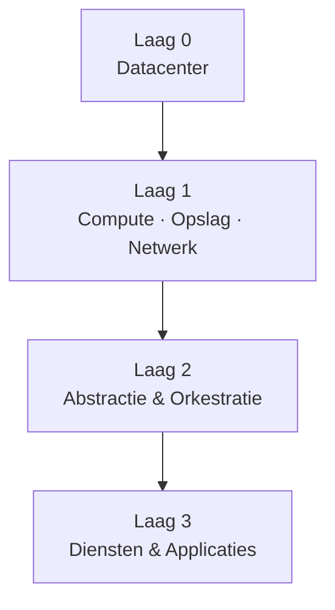

# Mprjv65 – de cloud als gelaagde omgeving

Wanneer we het over “de cloud” hebben, klinkt het vaak alsof het om één samenhangend geheel gaat. In werkelijkheid bestaat de cloud uit een aantal afzonderlijke lagen, die elk een ander niveau van abstractie vertegenwoordigen.

Door die lagen expliciet te maken, ontstaat een kader waarin keuzes later geplaatst kunnen worden — zonder ze nu al inhoudelijk te maken.

## Laag 0 – het datacenter

Onderaan elke cloudomgeving bevindt zich een fysiek fundament: datacenters met servers, netwerkapparatuur, stroomvoorziening en koeling.

Voor deze laag bestaat expliciet een keuze: zij kan zelf worden ingericht of worden afgenomen als dienst. In veel omgevingen wordt het fysieke fundament ingekocht, simpelweg omdat schaal en kosten dat aantrekkelijk maken.

Binnen Mprjv65 wordt hier bewust een andere afslag genomen. Niet omdat dat per definitie beter is, maar omdat de beoogde schaal beperkt is: de gebruikerspopulatie bestaat uit mijzelf en mijn vriendin. Dat maakt bepaalde keuzes mogelijk die in een productieomgeving economisch weinig overtuigend zouden zijn.

Tegelijkertijd is het ontwerp nadrukkelijk niet aan deze implementatie gebonden. Uitgangspunt  blijft dat deze laag elders ondergebracht kan worden, zonder dat dit gevolgen heeft voor de structuur van de lagen daarboven.

## Laag 1 – rekenkracht, opslag en netwerk

Bovenop het fysieke fundament liggen de klassieke IT‑bouwstenen:
- rekenkracht (CPU)
- geheugen
- opslag
- netwerk

Op deze laag worden deze middelen losgekoppeld van specifieke hardware. Ze bestaan niet langer als vaste componenten in één systeem, maar als abstracte capaciteit die kan worden toegewezen waar nodig.

Deze laag kan op twee manieren worden ingevuld: door middelen zelf te organiseren, of door ze als dienst af te nemen. In beide gevallen gaat het om dezelfde bouwstenen; alleen de manier waarop ze worden aangeboden en benaderd verschilt.

Binnen Mprjv65 worden deze middelen lokaal ingezet, passend bij de beperkte schaal van de omgeving. Die keuze zegt niets over het model zelf: de laag veronderstelt geen vaste locatie en kan zonder structurele wijzigingen elders worden ondergebracht.

Het principe blijft daarmee gelijk. Alleen de mate van abstractie en de vorm van levering verandert.

## Laag 2 – abstractie en orkestratie

De volgende laag bepaalt hoe rekenkracht, opslag en netwerk worden ingezet. Virtualisatie, containerisatie en orkestratie maken het mogelijk om workloads los te koppelen van vaste locaties.

Hier verplaatst de focus zich van individuele systemen naar beschrijvingen en afspraken: definities van wat moet draaien, onder welke voorwaarden, en met welke afhankelijkheden.

Ook deze laag kan zelf worden ingericht of worden afgenomen als onderdeel van een platform. In beide gevallen vervult hij dezelfde functie: het organiseren van middelen zonder directe betrokkenheid bij de fysieke onderlaag.

## Laag 3 – diensten en applicaties

Op deze laag wordt de cloud zichtbaar voor gebruikers. Applicaties en diensten presenteren zich hier als concrete functionaliteit: samenwerken, communiceren, bestanden benaderen en bewerken.

Voor veel gebruikers *is* dit de cloud. De keuze van client of dienst bepaalt hun ervaring; alles wat daaronder ligt, blijft buiten het waarnemingskader.

Vanuit beheerperspectief verschuift dat beeld. Juist de componenten die gebruikers niet direct zien — identity‑voorzieningen, mailtransport en ‑filtering, directory‑diensten en databases — vormen hier de kern van de cloudomgeving. Zij bepalen hoe diensten functioneren, met elkaar samenhangen en kunnen worden aangeboden.

De applicatie is daarmee het zichtbare eindpunt van een onderliggende keten. Wat voor een gebruiker op elkaar lijkt, kan in werkelijkheid op fundamenteel verschillende structuren rusten.

Wanneer een gebruiker een samenwerkingsapplicatie ziet, ziet hij niet de lagen die daaronder liggen. Zaken als identity‑management, opslag, mail‑transport en netwerkstructuren blijven buiten beeld. Toch bepalen juist die onderdelen hoe de applicatie zich gedraagt bij schaal, bij fouten of bij veranderingen.

Door die onderliggende structuur expliciet te maken, wordt duidelijk dat een applicatie nooit op zichzelf staat, maar altijd deel uitmaakt van een groter geheel.

## Lagen en keuzes

Deze gelaagde beschrijving is geen classificatie en geen architectuurvoorschrift. Het is een denkmodel dat laat zien waar keuzes kunnen worden gemaakt.

Per laag bestaat de mogelijkheid om:
- zelf te implementeren
- onderdelen in te kopen
- of een combinatie daarvan toe te passen

Dat noemen we vaak *cloud‑agnostisch*: niet gebonden zijn aan één specifieke leverancier of invulling, omdat het model zelf losstaat van de implementatie.

Binnen Mprjv65 kies ik ervoor om alle lagen zelf te hosten en zelf te bouwen. Dat doe ik om een aantal expliciete redenen:

- De schaal is dusdanig dat zelf hosten praktisch haalbaar is.
- Op deze manier worden er geen details voor mij verborgen, wat mijn leerervaring ten goede komt.
- Ik wil laten zien dat dit technisch gewoon mogelijk is.
- En niet onbelangrijk: ik wil hier geen financiële middelen aan spenderen.

In een productieomgeving zou ik andere keuzes maken. Waar het ontkoppelpunt dan precies ligt, weet ik niet vooraf. Dat zou afhankelijk zijn van hoeveel controle ik bereid ben in te ruilen voor het gemak van het uitbesteden aan derden.

Deze keuzes per laag hebben consequenties die verder gaan dan techniek alleen. Per ontkoppelpunt verschuift niet alleen de manier waarop systemen worden ingericht, maar ook hoe verantwoordelijkheid, inzicht en verantwoording georganiseerd zijn.

Governance en compliance – waaronder wetgeving als de AVG – vormen hierbij geen aparte laag, maar stellen randvoorwaarden aan alle lagen tegelijk. Ze bepalen niet *hoe* iets technisch wordt opgelost, maar *wat* uitlegbaar, beheersbaar en verantwoord moet blijven.

In dit artikel laat ik die consequenties bewust op hoofdlijnen. De uitwerking ervan vraagt om een eigen context en verdieping, die pas zinvol wordt zodra de onderliggende structuur en keuzeruimte helder zijn.

## Niet‑agnostische platformen

Er bestaan ook platformen die deze lagen bewust als één geheel aanbieden. Omgevingen zoals Microsoft 365 of Google Workspace kiezen expliciet voor een geïntegreerde benadering, waarbij de afzonderlijke lagen niet of nauwelijks los van elkaar bestaan.

Dat maakt deze platformen niet minder waardevol, maar wel fundamenteel anders. Ze zijn niet agnostisch; ze zijn ontworpen als samenhangend ecosysteem waarin keuzes vooraf zijn gemaakt.

Begrijpen waar die keuzes liggen, is alleen mogelijk wanneer de onderliggende lagen expliciet zijn.

## Een kapstok voor vervolg

Dit artikel introduceert geen oplossing en beschrijft geen inrichting. Het maakt alleen zichtbaar hoe de cloud als constructie is opgebouwd, en waar abstrahering plaatsvindt.

Binnen Mprjv65 dient dit model als kapstok: een structuur waaraan latere onderdelen opgehangen kunnen worden, zonder dat het geheel opnieuw gedefinieerd hoeft te worden. Daarbij ligt de focus niet op de zichtbare diensten aan de bovenkant van de stack, maar op de onderliggende platformcomponenten waarop die diensten rusten.

Die verschuiving in aandacht bepaalt wat hierna wordt uitgewerkt.